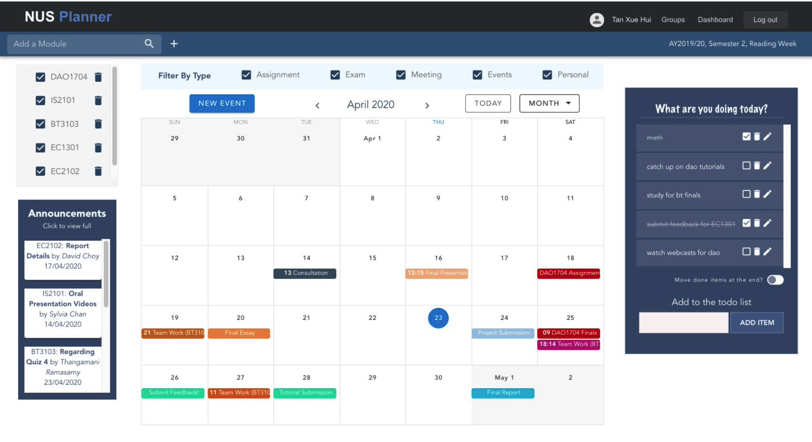
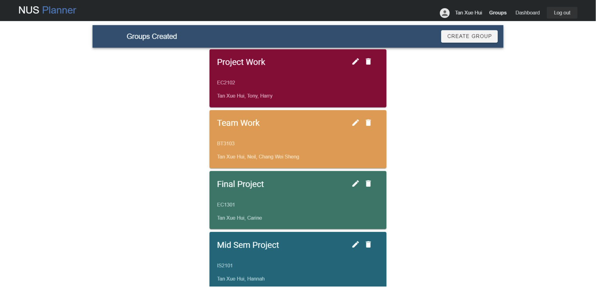
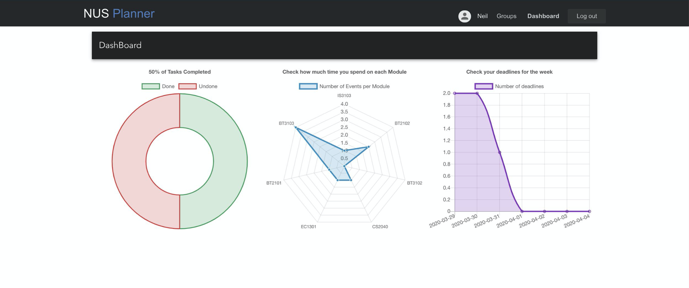
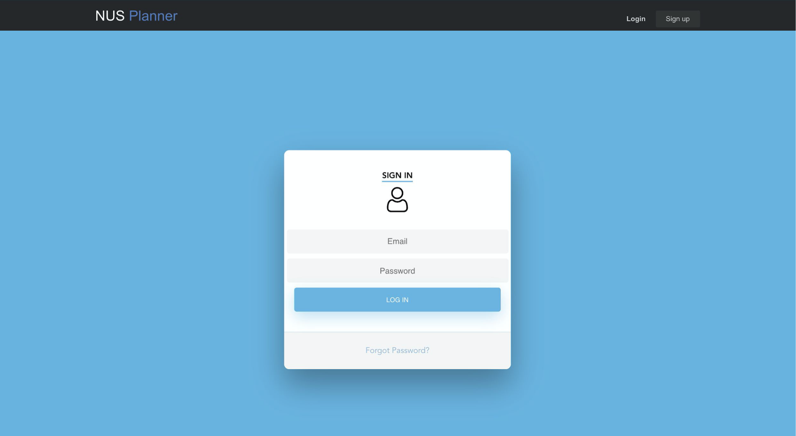

# NUS Planner

This is our offical project for BT3103 Web Application Development.

This project is created using Vue.js and Firebase.It is meant to be a web application that aims to encompass all the common functionalities that a NUS student would require.

It supports the following features:
- User Authentication
- To Do List Tracker
- Completely Responsive Calendar with Tagging for Modules
- Creation of Groups so an event/meeting for one member is reflected for all members in the group
- Module Deadlines: Exams, Submissions, etc. associated with a module appear if the user subscribes to a specific module
- Announcements: Allows for the tracking of all important announcements and changes in a unified view
- Analytics dashboard to trakc productivity across modules.
